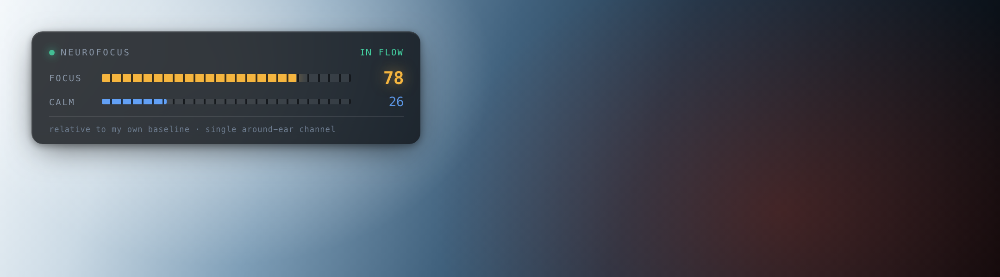
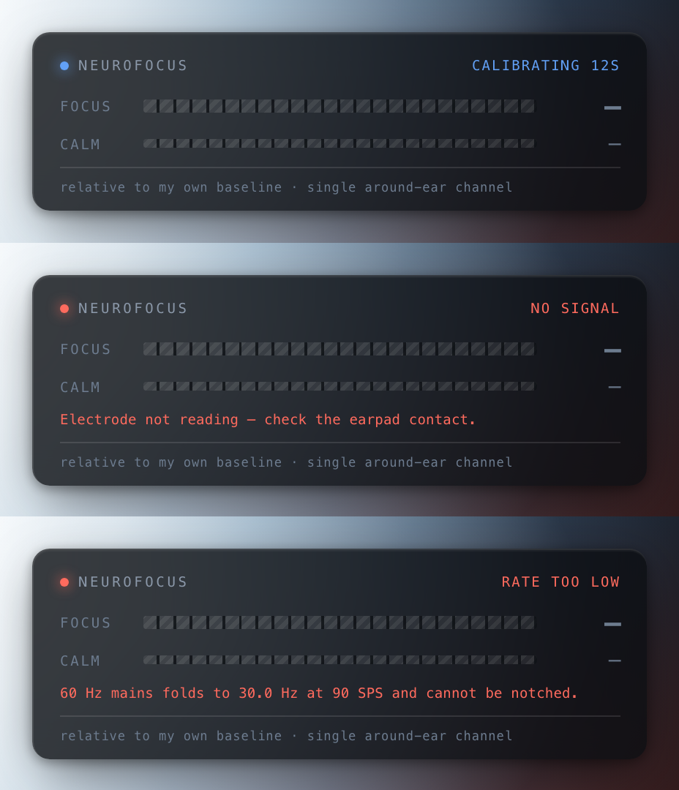
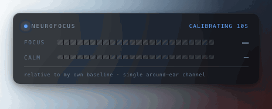
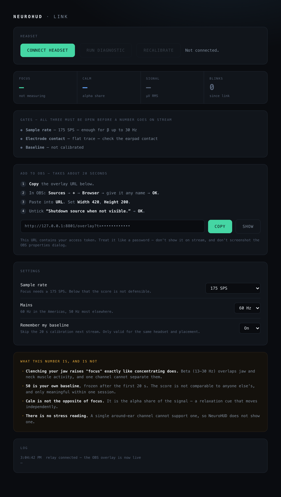

<div align="center">

# NeuroHUD

**Your focus, live on stream.**

A dry-EEG headset as an OBS browser source — that refuses to show a number it can't defend.

[](#run-it)
[](#run-it)
[](#tests)
[](LICENSE)



</div>

---

## The overlay is pointed at an audience

That is the whole design constraint.

A focus score from one EEG channel has three well-understood ways of lying, and every one of them
lies *upward* — toward "flawless concentration":

- **A detached electrode** collapses α+θ toward the ADC noise floor, so β/(α+θ) *explodes*. An
  unplugged headset reads as perfect focus.
- **Below 175 SPS**, 60 Hz mains aliases straight into the β band (→ 15 Hz at 45 SPS, → 30 Hz at
  90 SPS) where it cannot be notched. Mains hum reads as concentration.
- **Before the baseline is frozen**, there is nothing for 50 to be 50% *of*.

So NeuroHUD gates the number, and the gate is enforced at the **wire boundary** — `focus` and
`calm` are `null` in the payload unless all three are open. The renderer cannot leak a score the
signal did not earn, because it is never sent one.



A hatched bar and an em-dash, never an empty bar and a zero. **Zero is a measurement. This is the
absence of one.**

There is a fourth failure that only exists on a stream: the Chrome tab dies and the last good
number sits frozen on the broadcast, looking perfectly healthy, for the next six hours. The
overlay watchdogs its own telemetry and fades out after 3 s of silence.

<div align="center">

</div>

## Run it

Two processes, because **OBS's browser source cannot do Web Bluetooth** — its embedded Chromium
ships without the backend, and Web Bluetooth needs a device chooser a background source can never
present. So the headset link lives in a real Chrome tab and reaches OBS over a local relay.

```bash
git clone https://github.com/enkhbold470/neurohud.git
cd neurohud && bun install
bun start
```

The server prints two URLs:

1. **Open the `/link` URL in Chrome** and connect your headset. Calibrate for 20 s *before* you go
   live.
2. **Paste the `/overlay` URL into OBS** → Sources → **+** → **Browser**. 420 × 200. Untick
   *"Shutdown source when not visible"*.

```
Chrome tab (/link)              relay              OBS / Streamlabs / vMix
──────────────────           ───────────          ───────────────────────
Web Bluetooth ─┐
NeuroLink      │   WS push   ┌──────────┐  WS    ┌────────────────┐
FocusEngine  ──┴────────────▶│  fan-out │───────▶│ Browser Source │
                 (10 Hz)     └──────────┘        └────────────────┘
                                   ├── GET /state.json   (bots, Streamer.bot)
                                   └── state/focus.txt   (OBS Text source — no graphics)
```

Works with anything that has a browser source: OBS, Streamlabs, XSplit, vMix.



## Security — read this one

The relay carries a live biometric readout and can put numbers on a live broadcast. **"It's only
on localhost" is not a security boundary**: every page in every tab you have open can reach
`127.0.0.1`, and **WebSockets get no CORS preflight**. Unguarded, any site you visit while
streaming could open `ws://127.0.0.1:8787/ws?role=source` and push fabricated numbers onto your
stream — or open `?role=view` and quietly log when you focus, blink, and step away.

That is cross-site WebSocket hijacking, and three independent checks close it:

| Check | Stops |
|---|---|
| **Loopback bind** | The relay is not on the network at all by default. |
| **Origin + Host pinning** | A cross-site page announces its real `Origin`. Pinning `Host` too defeats DNS rebinding, which slips past an origin check alone. |
| **Bearer token** | Generated on first run into `state/token` (gitignored, `0600`), never committed. Stops a non-browser local process that sends no `Origin` at all. |

No wildcard CORS, anywhere. `/state.json` requires the token. The token lives in the URLs the
server prints — **treat them like a password, and don't screenshot the OBS properties dialog on
stream.**

## The metric

The **Pope, Bogart & Bartolome (1995)** engagement index ([PMID 7647180][pope]):

```
E = β / (α + θ)
```

Never θ/β — that ratio rises with *in*attention. E is unbounded, so it maps to 0–100 by a logistic
against a per-user baseline E₀, frozen after 20 s:

```
score = 100 / (1 + (E₀/E)^k)        k = 1.5
```

which is exactly **50 when E = E₀**.

**50 means your own baseline.** Not comparable between people, and only within one session. β also
overlaps jaw and neck EMG, so **clenching your teeth raises "focus" exactly as concentrating
does** — one channel cannot separate them. The link page says so, permanently, where you'll see
it.

**There is no stress reading, and there will not be one.** A single around-ear channel cannot
support that claim, so NeuroHUD does not make it. What it shows beside focus is **Calm** — the α
share of the signal, a relaxation cue that moves independently. It is *not* `100 − focus`.

[pope]: https://pubmed.ncbi.nlm.nih.gov/7647180/

## Hardware

Built for the **NeuroFocus Vertex v4** — a single around-ear dry electrode in a gaming-headset
insert. Not Fp1, not frontal, not prefrontal: an earpad electrode is physically *around-ear*.

| | |
|---|---|
| MCU / ADC | Seeed XIAO ESP32-S3 · TI ADS1220, 24-bit |
| Front end | AD8422 instrumentation amp, G = 100 |
| Channels | **1** (proof of concept) |
| Sample rate | 20/45/90/**175**/330/600/1000/2000 SPS — **focus needs ≥ 175** |
| Transport | BLE · `[0xE7 0x1E][seq u16 LE][n u8][n × i32 LE]` |

The board is the authority on its own sample rate — NeuroHUD reads `sps` from the firmware's
`INFO` line and retunes the DSP live. A client that hard-codes `fs` renders real 10 Hz α at 34 Hz
and slides every frequency by the same ratio.

## Layout

```
server.ts              the relay — auth, fan-out, last-value cache
src/lib/wire.ts        the honesty gate. focus is null unless every gate is open
src/lib/security.ts    origin pinning, host pinning, constant-time token compare
src/lib/config.ts      generated token, env overrides — nothing hardcoded
src/link/              the Chrome page: Web Bluetooth + DSP + calibration
src/overlay/           the OBS page: renders state, and refuses to render a number
src/lib/{ble,dsp,focus,adc}.ts   vendored from the NeuroFocus analyzer — do not edit
```

`ble.ts`, `dsp.ts`, `focus.ts` and `adc.ts` are vendored byte-identical from the browser analyzer
so the two cannot disagree about what a brain is doing. `bun run check:lib` fails the build if
they drift; their own test suites come along to prove they didn't.

## Tests

```bash
bun run test      # everything: drift → units → types → browser
```

> Use `bun run test`, not `bun test` — the latter is Bun's own runner, which would try to collect
> the Playwright specs and fall over.

116 tests, no hardware required. They pin the things that would put a false number in front of an
audience:

- a detached electrode yields `focus: null` — not `99`
- 60 Hz mains folds to exactly 30.0 Hz at 90 SPS, and the wire refuses to score there
- mid-calibration renders an em-dash, and **no digit appears anywhere on the page**
- the overlay goes dark when the link dies, rather than freezing its last good number
- a cross-site page cannot open a source socket, even holding the token
- a DNS-rebound `Host` is refused even with a valid token and a same-origin `Origin`

## Status — read this before you judge the screenshots

**No image in this README is a real EEG capture.** They are the real overlay, rendered by the real
relay, driven through the real gate — but the input is generated telemetry, not a person wearing
the headset. **This has not yet been run against physical hardware.**

When it has, these images get replaced with a real capture and this section gets deleted.

It would have been easy to ship a screenshot that implied otherwise. That is the exact thing this
codebase exists to refuse, and the rule does not stop applying at the README.

## Not a medical device

NeuroHUD does not diagnose, treat, cure or prevent anything. Don't make a medical decision with
it, and don't let your chat make one either.

## License

[MIT](LICENSE) © Enkhbold Ganbold
